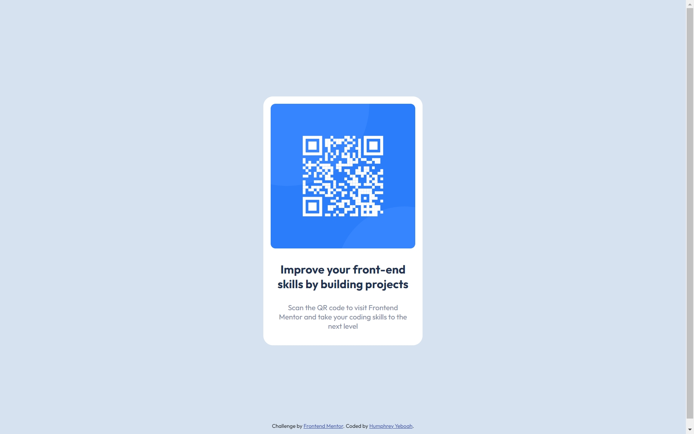

<!-- @format -->

# Frontend Mentor - QR code component solution

This is a solution to the [QR code component challenge on Frontend Mentor](https://www.frontendmentor.io/challenges/qr-code-component-iux_sIO_H). Frontend Mentor challenges help you improve your coding skills by building realistic projects.

## Table of contents

- [Overview](#overview)
  - [Screenshot](#screenshot)
  - [Links](#links)
- [My process](#my-process)
  - [Built with](#built-with)
  - [What I learned](#what-i-learned)
- [Author](#author)

## Overview

### Screenshot

### Links

- Solution URL: [Github repo for solution](https://github.com/hakylepremier/qr-code-component-frontend/)
- Live Site URL: [Live site link](https://hakylepremier.github.io/qr-code-component-frontend/)

## My process

### Built with

- Semantic HTML5 markup
- CSS

### What I learned

I learned that when you use the figure semantic tag, you should be aware of the default margin it comes with.

## Author

- Website - [Humphrey Yeboah](https://www.humphreyyeboah.com)
- Frontend Mentor - [@hakylepremier](https://www.frontendmentor.io/profile/hakylepremier)
- Twitter(X) - [@hakylepremier](https://www.twitter.com/hakylepremier)
